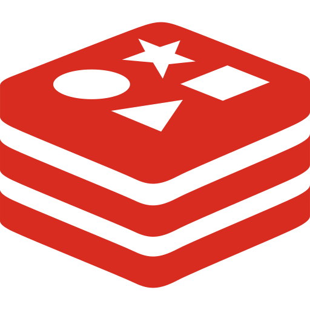

<p align="center">
  
</p>

<h1 align="center">Rediscope</h1>

<p align="center">
  <strong>A Modern Redis UI for Laravel Applications</strong>
</p>

<p align="center">
  <a href="https://github.com/tushar-arote/Rediscope/actions"></a>
  <a href="https://packagist.org/packages/tushar-arote/rediscope"></a>
  <a href="https://packagist.org/packages/tushar-arote/rediscope"></a>
  <a href="https://packagist.org/packages/tushar-arote/rediscope"></a>
</p>

## 📋 Introduction

Rediscope is a powerful, elegant Redis cache manager and UI for the Laravel framework. It provides an intuitive web interface to manage, monitor, and interact with Redis data structures in real-time.

### ✨ Features

- **Redis Management**: View, create, edit, and delete Redis keys effortlessly
- **Data Type Support**: Full support for Strings, Hashes, Lists, Sets, and Sorted Sets
- **Key Scanning**: Efficiently scan Redis keys with pattern matching
- **TTL Management**: View and manage key expiration times
- **Real-time Monitoring**: View Redis server information and statistics
- **Dark Mode**: Beautiful dark theme for comfortable viewing
- **Responsive UI**: Works seamlessly on desktop and mobile devices
- **Type-Safe**: Modern PHP 8.1+ and Laravel 8-11 support

## 🚀 Requirements

- **PHP**: 8.1, 8.2, 8.3, or 8.4
- **Laravel**: 8.0, 9.0, 10.0, 11.0, or 12.0
- **Redis**: 4.0 or higher
- **Redis client**: [predis/predis](https://github.com/predis/predis) — Rediscope uses Laravel's `Redis` facade against the `predis` client. Fresh Laravel 11/12 apps default `REDIS_CLIENT` to `phpredis` in `.env`; set `REDIS_CLIENT=predis` (and `composer require predis/predis` if not already installed) or Rediscope won't be able to connect.

## 📦 Installation

### Step 1: Install via Composer

```bash
composer require tushar-arote/rediscope
```

### Step 2: Publish Configuration (Optional)

```bash
php artisan vendor:publish --provider="Rediscope\RediscopeServiceProvider" --tag="rediscope-config"
```

This publishes the configuration file to `config/rediscope.php`. Skip this step if you're happy with the defaults — Rediscope works out of the box without it.

Frontend assets (including the favicon) are served directly by the package, so there's no build step required after `composer require`.

### Step 3: Configure Authorization (Optional)

By default, Rediscope is only accessible in the `local` environment. To customize access, update your `AppServiceProvider`:

```php
use Rediscope\Rediscope;

public function boot()
{
    Rediscope::auth(function ($request) {
        return auth()->check() && auth()->user()->isAdmin();
    });
}
```

## 🔧 Configuration

The configuration file contains settings for:

- **Path**: Dashboard path (default: `/rediscope`)
- **Pagination**: Results per page (default: 50)
- **Theme**: Default theme (light or dark)

Edit `config/rediscope.php` to customize these settings.

## 🎯 Usage

### Accessing the Dashboard

After installation, access Rediscope at:

```
http://your-app.local/rediscope
```

### Key Operations

#### View Keys
- Navigate to the "Keys" section
- Use the search bar to filter keys by pattern
- Click any key to view its content

#### Manage Strings
- View string values
- Edit values directly in the UI
- Set expiration time (TTL)

#### Manage Hashes
- Add, edit, or remove hash fields
- View all fields in a hash at once

#### Manage Lists
- Push and pop items from lists
- Edit list items by index
- View list length

#### Manage Sets
- Add and remove set members
- View all members
- Check set cardinality

#### Manage Sorted Sets
- Add, edit, and remove members with scores
- Sort by score or member name
- View range queries

### Server Information

The "Info" section displays:
- Memory usage and statistics
- CPU metrics
- Client connections
- Command statistics

## 🎨 UI Features

### Dark Mode
Toggle dark mode using the theme switcher in the top-right corner. Your preference is remembered locally.

### Responsive Design
The interface is fully responsive and works on:
- Desktop browsers (Chrome, Firefox, Safari, Edge)
- Tablets
- Mobile devices

## 🔐 Security

### Authentication
By default, Rediscope is only accessible in the `local` environment. In production, you **must** configure proper authentication using the `Rediscope::auth()` method.

### Authorization
Implement your own authorization logic to restrict access:

```php
Rediscope::auth(function ($request) {
    return auth()->check() && auth()->user()->hasRole('developer');
});
```

## 🛠️ Development

### Building Assets

```bash
# Development build with watch
npm run watch

# Production build
npm run prod

# Hot reload development
npm run hot
```

### Running Tests

```bash
php vendor/bin/phpunit
```

## 📋 Supported Redis Data Types

- ✅ **Strings** - Simple key-value storage
- ✅ **Hashes** - Field-value pairs
- ✅ **Lists** - Ordered collections
- ✅ **Sets** - Unordered unique collections
- ✅ **Sorted Sets** - Scored members

## 🔄 Version Support

| Version | PHP | Laravel | Status |
|---------|-----|---------|--------|
| 2.0 | 8.1 - 8.4 | 8, 9, 10, 11, 12 | ✅ Current |
| 1.0 | 7.2+ | 6, 7 | 🔄 Legacy |

## 🐛 Troubleshooting

### Rediscope Dashboard Not Loading

1. Verify Redis is running: `redis-cli ping`
2. Check Laravel Redis configuration in `config/database.php`
3. Clear application cache: `php artisan cache:clear`
4. Confirm `REDIS_CLIENT=predis` in `.env` — fresh Laravel 11/12 apps default to `phpredis`, which Rediscope doesn't use (see Requirements above)

### Authentication Issues

1. Verify your `Rediscope::auth()` configuration
2. Check application environment (`APP_ENV`)
3. Ensure you're accessing from correct domain/IP

### Asset Loading Issues

Assets are served by the package itself at `/vendor/rediscope/*`, with no build step required. If they still don't load:

1. Confirm `composer require tushar-arote/rediscope` completed successfully and `vendor/tushar-arote/rediscope/public/` contains `app.js`/`app.css`
2. Clear the route cache: `php artisan route:clear`
3. Check for a conflicting route or middleware intercepting `/vendor/rediscope/*`

## 🤝 Contributing

Contributions are welcome! Please feel free to submit issues and pull requests.

### Development Setup

1. Clone the repository
2. Run `composer install` and `npm install`
3. Create a feature branch
4. Make your changes
5. Submit a pull request

## 📄 License

The Rediscope package is open-sourced software licensed under the [MIT license](LICENSE.md).

## 👨‍💻 Author

**Tushar Arote**
- Email: tushararote123@gmail.com
- GitHub: [@tushar-arote](https://github.com/tushar-arote)

## 🙏 Acknowledgments

- Inspired by [Laravel Telescope](https://laravel.com/docs/telescope)
- Built with [Vue.js](https://vuejs.org/) and [Bootstrap 5](https://getbootstrap.com/)
- Powered by [Predis](https://github.com/predis/predis)

## 📞 Support

For issues, questions, or suggestions:
1. Open an issue on [GitHub](https://github.com/tushar-arote/rediscope)
2. Check existing issues first
3. Provide detailed reproduction steps

---

**Made with ❤️ for Laravel developers**