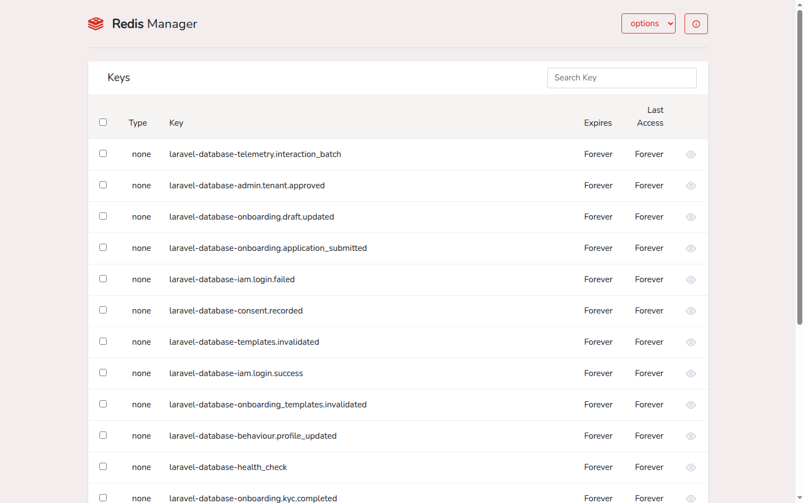

<p align="center">
  
</p>

<h1 align="center">Rediscope</h1>

<p align="center">
  <strong>A Modern Redis UI for Laravel Applications</strong>
</p>

<p align="center">
  <a href="https://github.com/tushar-arote/Rediscope/actions"></a>
  <a href="https://packagist.org/packages/tushar-arote/rediscope"></a>
  <a href="https://packagist.org/packages/tushar-arote/rediscope"></a>
  <a href="https://packagist.org/packages/tushar-arote/rediscope"></a>
</p>

## 📋 Introduction

Rediscope is a powerful, elegant Redis cache manager and UI for the Laravel framework. It provides an intuitive web interface to manage, monitor, and interact with Redis data structures in real-time.

<p align="center">
  
</p>

### ✨ Features

- View, create, edit, and delete keys across **Strings, Hashes, Lists, Sets, and Sorted Sets**
- Scan keys with pattern matching, and view/manage TTLs
- Real-time server info (memory, CPU, client connections, command stats)
- Dark mode, with your preference remembered locally
- Responsive UI that works on desktop and mobile

## 🚀 Requirements

- **PHP**: 8.1, 8.2, 8.3, or 8.4
- **Laravel**: 8.0, 9.0, 10.0, 11.0, or 12.0
- **Redis**: 4.0 or higher
- **Redis client**: [predis/predis](https://github.com/predis/predis) — Rediscope uses Laravel's `Redis` facade against the `predis` client. Fresh Laravel 11/12 apps default `REDIS_CLIENT` to `phpredis` in `.env`; set `REDIS_CLIENT=predis` (and `composer require predis/predis` if not already installed) or Rediscope won't be able to connect.

## 📦 Installation

### Step 1: Install via Composer

```bash
composer require tushar-arote/rediscope
```

### Step 2: Publish Configuration (Optional)

```bash
php artisan vendor:publish --provider="Rediscope\RediscopeServiceProvider" --tag="rediscope-config"
```

This publishes the configuration file to `config/rediscope.php`. Skip this step if you're happy with the defaults — Rediscope works out of the box without it.

Frontend assets (including the favicon) are served directly by the package, so there's no build step required after `composer require`.

### Step 3: Configure Authorization (Optional)

By default, Rediscope is only accessible in the `local` environment. To customize access, update your `AppServiceProvider`:

```php
use Rediscope\Rediscope;

public function boot()
{
    Rediscope::auth(function ($request) {
        return auth()->check() && auth()->user()->isAdmin();
    });
}
```

## 🔧 Configuration

The configuration file contains settings for:

- **Path**: Dashboard path (default: `/rediscope`)
- **Pagination**: Results per page (default: 50)
- **Theme**: Default theme (light or dark)

Edit `config/rediscope.php` to customize these settings.

## 🎯 Usage

### Accessing the Dashboard

After installation, access Rediscope at:

```
http://your-app.local/rediscope
```

Browse and search keys in the "Keys" section, click any key to view or edit its content, and check the "Info" section for server memory/CPU/client/command statistics. Toggle dark mode using the theme switcher in the top-right corner — your preference is remembered locally.

## 🔐 Security

By default, Rediscope is only accessible in the `local` environment. In production, you **must** configure authorization via `Rediscope::auth()` (see Step 3 above) — the callback can check anything (auth, roles, IP, etc.) since it just returns a boolean:

```php
Rediscope::auth(function ($request) {
    return auth()->check() && auth()->user()->hasRole('developer');
});
```

Found a vulnerability? Please see [SECURITY.md](SECURITY.md) instead of opening a public issue.

## 🐛 Troubleshooting

### Rediscope Dashboard Not Loading

1. Verify Redis is running: `redis-cli ping`
2. Check Laravel Redis configuration in `config/database.php`
3. Clear application cache: `php artisan cache:clear`
4. Confirm `REDIS_CLIENT=predis` in `.env` — fresh Laravel 11/12 apps default to `phpredis`, which Rediscope doesn't use (see Requirements above)

### Authentication Issues

1. Verify your `Rediscope::auth()` configuration
2. Check application environment (`APP_ENV`)
3. Ensure you're accessing from correct domain/IP

### Asset Loading Issues

Assets are served by the package itself at `/vendor/rediscope/*`, with no build step required. If they still don't load:

1. Confirm `composer require tushar-arote/rediscope` completed successfully and `vendor/tushar-arote/rediscope/public/` contains `app.js`/`app.css`
2. Clear the route cache: `php artisan route:clear`
3. Check for a conflicting route or middleware intercepting `/vendor/rediscope/*`

## 🤝 Contributing & Support

Contributions are welcome! See [CONTRIBUTING.md](CONTRIBUTING.md) for dev setup, running tests, and PR guidelines. For bugs or questions, [open an issue on GitHub](https://github.com/tushar-arote/rediscope/issues) with reproduction steps.

## 📄 License

Open-sourced software licensed under the [MIT license](LICENSE.md).

## 👨‍💻 Author

**Tushar Arote** — tushararote123@gmail.com — [@tushar-arote](https://github.com/tushar-arote)

Built with [Vue.js](https://vuejs.org/) and [Bootstrap](https://getbootstrap.com/), powered by [Predis](https://github.com/predis/predis).